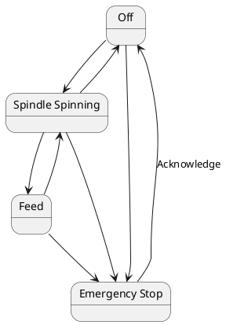

# Distributed FSM Examples

**Features**
- Type Save FSM (type state pattern)
- FSM run in their own thread
- communication via message queues
- State Transition and message handling boiler plate managed by `fsm!` macro

One such FSM is a simplistic lathe

