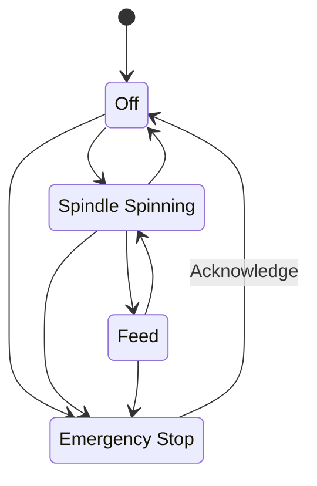
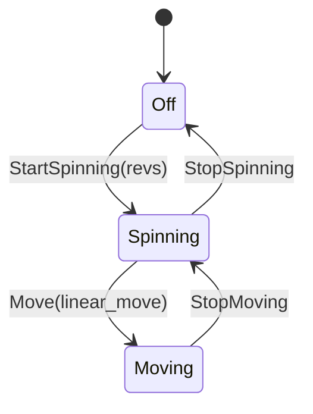

# Distributed FSM Examples

**Features**
- Type Save FSM (type state pattern)
- FSM run in their own thread
- Communication via bidirectional message queues
- State transition and message handling boiler plate managed by `fsm!` macro

One such FSM is a simplistic lathe:

Another FSM is a Mill with different state transitions but based on the same mechanics

