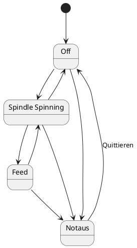

```plantuml
@startuml
state "Off" as off
state "Spindle Spinning" as spinning
state "Feed" as feeding
state "Notaus" as notaus

[*] --> off
' off --> off
off --> spinning
' spinning  --> spinning
spinning --> feeding
spinning --> off
feeding --> spinning
' feeding --> feeding
off --> notaus
spinning --> notaus
feeding --> notaus
notaus --> off: Quittieren


@enduml

```
